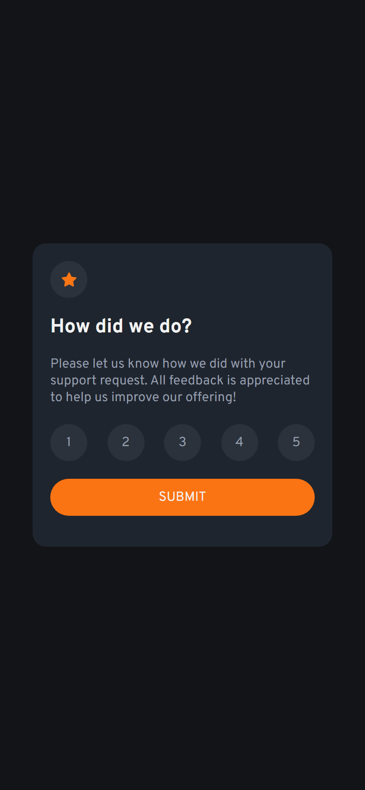

# Frontend Mentor - Interactive rating component solution

This is a solution to
the [Interactive rating component challenge on Frontend Mentor](https://www.frontendmentor.io/challenges/interactive-rating-component-koxpeBUmI)

## Table of contents

- [Overview](#overview)
    - [The challenge](#the-challenge)
    - [Screenshot](#screenshot)
    - [Links](#links)
- [My process](#my-process)
    - [Built with](#built-with)
    - [What I learned](#what-i-learned)
    - [Useful resources](#useful-resources)
- [Author](#author)

## Overview

### The challenge

Users should be able to:

- View the optimal layout for the app depending on their device's screen size
- See hover states for all interactive elements on the page
- Select and submit a number rating
- See the "Thank you" card state after submitting a rating

### Screenshot

### Links

- Solution URL: [GitHub](https://github.com/MarkGrushevski/interactive-rating-component)
- Live Site URL: [Vercel](https://interactive-rating-component-one-eta.vercel.app/)

## My process

### Built with

- Semantic HTML5 markup
- SCSS modules
- Flexbox
- Mobile-first workflow
- [Vite](https://vitejs.dev/) - Build tool
- [React](https://reactjs.org/) - JS library
- [Autoprefixer](https://github.com/postcss/autoprefixer) - For vendor prefixes
- [ESLint](https://eslint.org/) - JS linter
- [Stylelint](https://stylelint.io/) - SCSS linter
- [Prettier](https://prettier.io/) - Code formatter
- [Lint-staged](https://github.com/okonet/lint-staged) - For pre-commit run linters
- [Husky](https://typicode.github.io/husky/#/) - For pre-commit run scripts

### What I learned

Нового в этом проекте я не изучил, лишь закрепил свои знания по работе с состоянием и формой в React.

### Useful resources

Самые полезные ресурсы для меня это документации технологий, книги и видео-туториалы

## Author

- GitHub - [Leonid Tupikin](https://github.com/MarkGrushevski)
